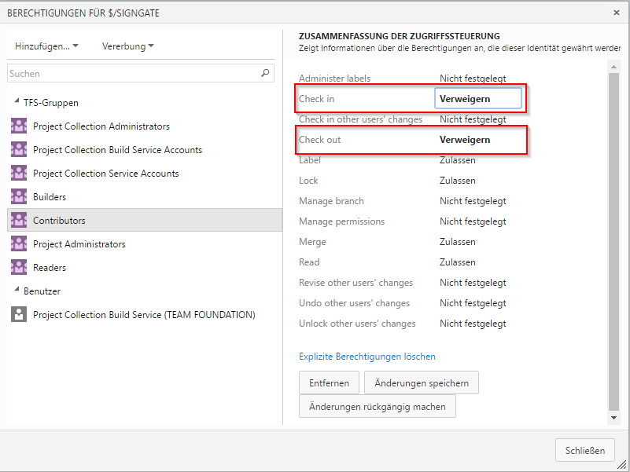
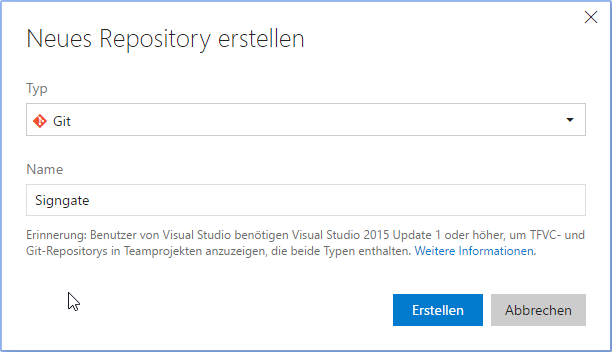

# The Distributed Way Of Version Control

Auf unserer andauernden Suche nach besseren Werkzeugen für Software Ingenieure ist es kaum möglich um das Thema Versionskontrolle herum zu kommen. Insbesondere GIT ist kaum zu vermeiden. Unser Team stellt momentan Schritt für Schritt ihre Versionskontrolle von TFS auf GIT um. Dieser Post soll aufzeigen, weshalb wir Git verwenden und wie du einfach von TFVC auf GIT migrieren kannst.

Die Arbeit mit TFVC kann sehr frustrierend sein: Die Versionkontrolle ist komplett in der IDE verzahnt, oft sehr langsam und fehleranfällig. Files werden jedes mal ausgecheckt, wenn sie geöffnet werden und wenn die Internetverbindung fehlt, friert Visual Studio teils für eine Minute oder mehr ein oder stürtzt ab. Branches legen komplette Kopien der Daten auf der Festplatte an was schrecklich langsam und eigentlich auch unnötig ist. Shelvesets können zwar reviewed werden - eine Anpassungen auf Grund des Reviews zu machen ist aber nicht möglich. Merges sind auf Grund der langlebigen Branches aufwändig und fehleranfällig und da Branches in der Handhabung so schwerfällig und teuer (Plattenspeicher!!) sind, wird das auch so bleiben. Hinzukommt das "Mindset" vieler eingefleischter VisualStudio User, sich um Versionskontrolle nicht kümmern zu müssen - wenn ein Checkin nicht funktioniert muss eben gemerged werden...

Ich frage mich regelmässig, ob Microsoft ihre eigenen Tools wirklich verwendet und wenn ja, wie sie damit zu frieden sein können, denn ich war es nicht im geringsten! Zuerst möchte ich etwas klarstellen: All diese Nachteile, welche ich hier aufgezählt habe sind nicht alle TFVC-spezifisch sondern sind so oft auch in SVN oder ähnlichen Systeme zu finden! Worum es in diesem Blogpost gehen soll, ist die Suche nach dem besten Tool für unsere tägliche Arbeit als Entwickler, denn wir sollten es uns wert sein! Und um Microsoft nach einer kurzen Schelte auch einmal zu Loben: Sie haben erkannt, dass es eine andere Lösung braucht; So unterstützt Team Foundation Server seit einigen Versionen auch GIT.

Wir als Team haben uns entschieden, voll auf GIT zu setzen und seit Beginn dieses Jahres, migrieren wir ein Repo nach dem anderen von TFVC auf GIT. Die Entscheidung wurde von allen Beteiligten aus der Abteilung gemeinsam und einstimmig getroffen: Die Vorteile wägen die Nachteile um ein Vielfaches auf!

Nachteile? Git? Ja! Git hat im Gegensatz zum populären Ton in der Entwickler Community auch (zugegeben wenige) Nachteile. Ein gewichtiger ist dabei seine Komplexität. Es ist nicht einfach die History wirklich sauber zu halten, ganz besonders wenn man im Team sehr eng zusammenarbeitet. Dies ist jedoch eine reine Übungssache und nach bald drei Monaten in denen mein (Enzian) Team Git nun verwendet, haben eigentlich alle den Dreh raus. Rebasings, Cherrypicking, Fetching, Branching sind in Fleisch und Blut übergegangen und die Vorteile liessen nicht lange auf sich warten. Unsere Versionkontrolle ist sehr agil geworden, wir erstellen sogar für kleine Features Branches, welche wir ständig aufeinander rebasen. Die Menge und Komplexität von Mergekonfliken ist durch das konstante Rebasen auf praktisch null gesunken. Code Reviews sind viel einfacher geworden, da Pull Requests in TFS-Web super umgesetzt wurden (Kudos an Microsoft hier!). Es spielt auch keine Rolle mehr, wo wir arbeiten - schliesslich sind wir nicht mehr auf den Server angewiesen um Änderungen committen zu können. Wir halten unsere History sauber indem wir Fixup und Autosquash benutzen und committen nur noch files, welche auch wirklich geändert wurden. (TFVC hat das überhaupt nicht im Griff!)

# Migration von TFVC zu GIT

Haben wir dein Interesse für GIT geweckt, stellt sich nun die Frage wie wir nun von TFVC auf GIT migrieren können ohne die gesamte History zu verlieren.
Es ist noch zu erwähnen, da wir nicht mit Work Items arbeiten ich keine Aussage dazu machen kann wie gelinkte Work-Items sich verhalten.

## Vorbereitungen
- Installation von Choco aus der Powershell mit dem Befehl:
```
iex ((new-object net.webclient).DownloadString('https://chocolatey.org/install.ps1'))
```

## Migration

1. Das gesamten Team dazu auffordern all Ihre Änderungen einzuchecken

2. Dann muss allen Benutzer die Berechtigung entzogen werden auf das TFVC Repository einzuchecken. Dies kannst du umsetzen wenn in der Team Foundation Server Web Oberfläche auf dem entsprechenden Project unter Code die Berechtigung editierst und da die Berechtigung für "Check In" und "Check Out" verweigerst.


3. Anschliessend muss man ein neues Repository erstellen welche nun natürlich GIT als Versionskontroll System verwendet.


4. Mit dem Tool [GIT TFS](https://github.com/git-tfs/git-tfs) auf Github kann auch TFVC von der GIT Konsole angesprochen werden, daher muss dies auch installiert werden.
Kann einfach mit chocolatey installiert werden
```
C:\> choco install gittfs
```

5. In meinen Tests funktionierte die Migration nicht mit Git Bash daher verwende ich Powershell mit dem Befehl werden alle Checkins aus einem TFVC Repository in ein lokales Git Repository migriert
```
git tfs clone https://TFS_SERVER:443/tfs/Collection $/project/branch . --branches=all
```

6. Mit folgendem Befehl werden anschliessend die Commit Messages welche von der Migration verschandelt wurden wieder in Ordnung gebracht:
```
git filter-branch -f --msg-filter "sed 's/^git-tfs-id:.*$//g'" -- --all
```
Mit dem GIT Log Befehl kann verifiziert werden, dass die Commit Messages nun wirklich nur noch die Checkin Message von TFVC haben.

7. Hier ist ein guter Zeitpunkt noch alle Vorbereitungen zu treffen bevor wir das Repo pushen. Zum Beispiel sollte hier das Gitignore File hinzugefügt werden. Dazu empfehle ich ein template von [den GitHub templates zu nehmen](https://github.com/github/gitignore)

8. Nun muss nur noch das Remote Repository auf dem TFS Server angegeben werden um den initial commit zu realisieren.
```
git remote add origin https://TFS_SERVER:443/tfs/project.git
```
9. Zum schluss muss alles in das neue TFS Git Repository gepushed werden:
```
git push --all origin
```
10. In unserem Fall hatten die Branches welche migriert wurden noch unschöne Namen wenn du diese auch anpassen möchtest kannst du folgendermassen vorgehen:
```
git branch -m old_branch new_branch         # Rename branch locally    
git push origin :old_branch                 # Delete the old branch    
git push --set-upstream origin new_branch   # Push the new branch, set local branch to track the new remote
```
https://gist.github.com/lttlrck/9628955
